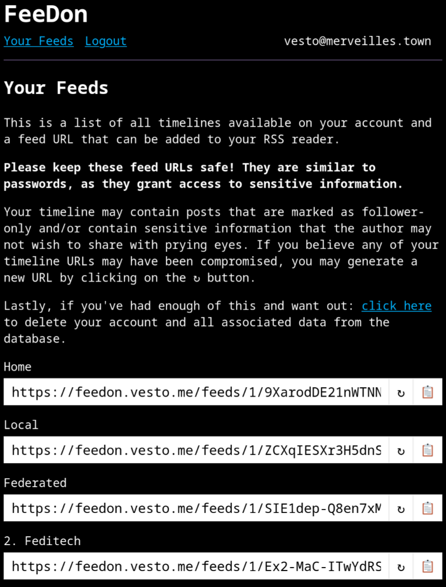

# FeeDon (fork)
**This is a fork of https://git.sr.ht/~vesto/feedon**


FeeDon is a service for Mastodon instances that allows users to generate RSS feeds from their home timeline, local timeline, and any lists they've created. Technically speaking you can _mostly_ do this by just subscribing to individual users' timelines in your RSS reader, but this doesn't work well if you want to keep your RSS reader in-sync with who you follow or follow users with private posts.



## Getting started
While it's perfectly possible to run your own instance, it's much easier to use somebody else's instance. If this takes off I hope to run a publicly accessible instance for others, but given that the project is still in its early phases I'm limiting my instance for a select number of testers.

If you'd like to help me test things out and provide feedback, feel free to [send an email](mailto:steve@stevegattuso.me) and I'll consider adding you in.

## Setup
Setting up a development instance is a bit tricky, as you really need to expose your instance to the internet at large in order for it to work properly. There are a variety of ways to accomplish this, and for the sake of brevity I'm going to avoid getting too far into the weeds on this for the time being. My personal dev setup involves running the Flask server on a VPS that uses [Caddy](https://caddyserver.com/) as a reverse proxy (with SSL).

To set up the project itself, run the following commands to clone the repo and install dependencies:

```
git clone https://github.com/senz/feedon.git
```

Open the project in [devcontainer](https://containers.dev) and run the following commands:


Once dependencies have been installed you'll need to create a `.env` file to configure your server:

```
SECRET_KEY=[long random string]
BASE_URL=https://your.instance.domain.com
```

Finally, you can spin up your server by running the following command:

```
make dev
```

If all goes well you should have a development server up and running and can navigate to your `BASE_URL` to log in and create some RSS feeds.

